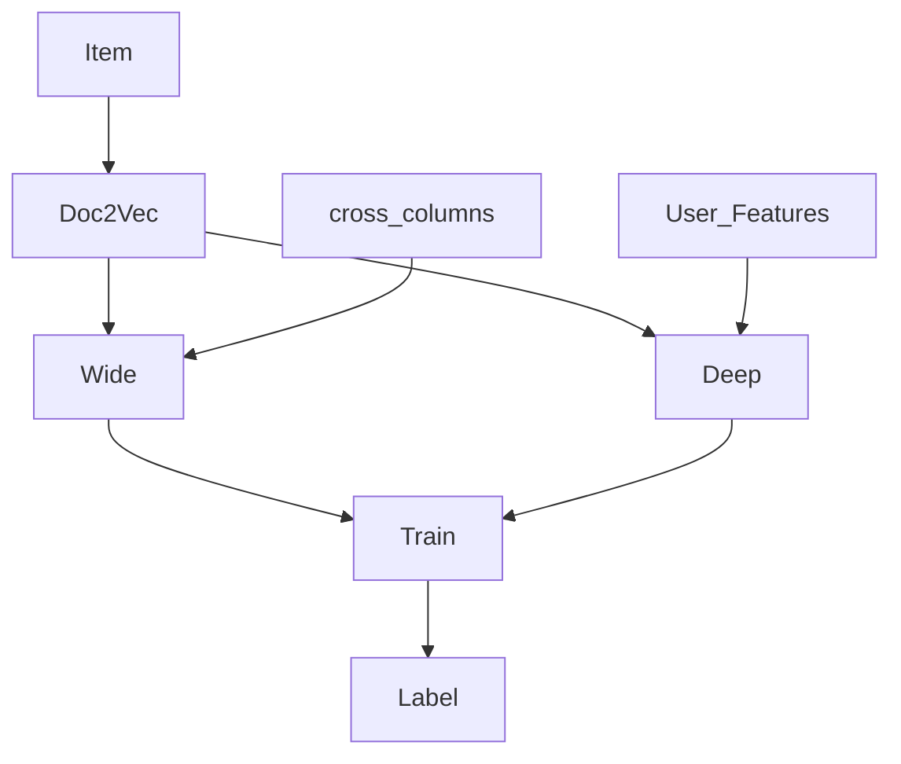
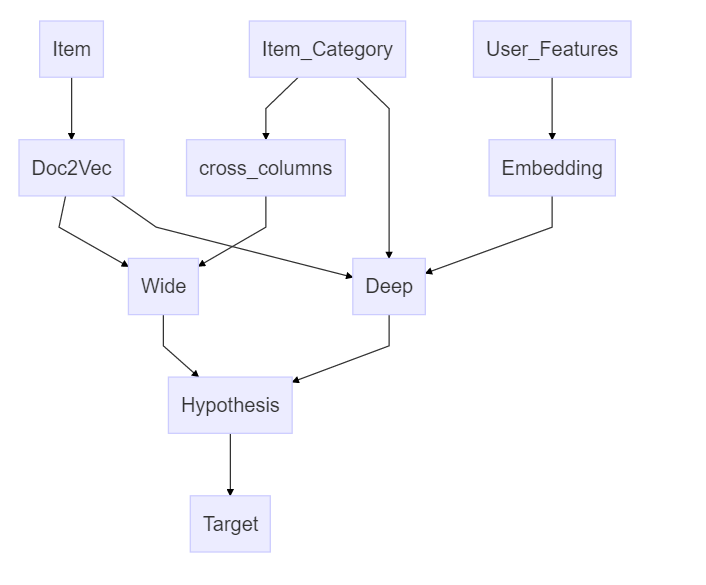
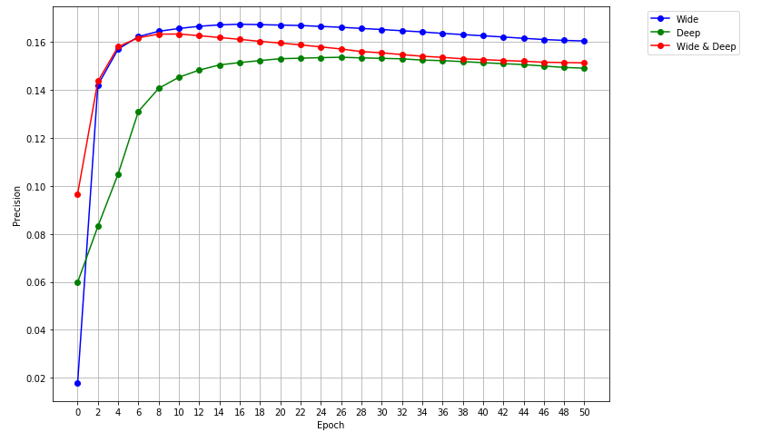

<meta name="generator" content="pandoc" />


# 해당 문서는

`Wide & Deep Learning with Tensorflow` 을 공부하면서 만든 ipynb 파일입니다.

* [시작할 때 도움되는 페이지](https://www.tensorflow.org/tutorials/wide_and_deep)  

* [Wide & Deep - paper](https://arxiv.org/abs/1606.07792)

---

* [TensorFlow Wide & Deep Learning Tutorial - with Census Data](https://github.com/Park-Ju-hyeong/Wide-Deep-Learning/blob/master/Wide%2B%26%2BDeep%2BLearning%2Bwith%2BCensus%2BData.ipynb) 는 Tensorflow 에서 제공하는 함수를 이용해서 만든 파일입니다. 

`python 2`에서 dict 처리할 때
```
feature_cols = dict(continuous_cols.items() + categorical_cols.items())
```  
`python 3`에서 dict 처리할 때   
```
feature_cols = {**continuous_cols , **categorical_cols}
```
---

처음에는 Tensorflow에서 제공하는 `DNNLinearCombined` 함수를 이용해서 제작할 생각이었습니다.  하지만 high level api 함수에서 batch로 넣는 법을 몰라 Low level Tensorflow로 직접 짜게 되었습니다.  
(Tensorflow Queue를 이용해야 한다고 합니다.)






prediction :  
             

* [Wide & Deep - Recommender system  / 추천시스템](https://github.com/Park-Ju-hyeong/Wide-Deep-Learning/blob/master/Wide%2526Deep%2BRecommendation-Final-Final.ipynb)  

* [Wide | Deep | Wide&Deep - 모형별 비교](https://github.com/Park-Ju-hyeong/Wide-Deep-Learning/blob/master/Wide%2526Deep%2BRecommendation-%255BWide%2Bvs%2BDeep%255D.ipynb)  
 


---
## 요구되는


```pip install tensorflow-gpu```  [Tensorflow](https://www.tensorflow.org/) An open-source software library for Machine Intelligence  

```pip install pandas```

```pip install numpy```  

```pip install pickle```

```pip install matplotlib```   


## 함수 짜는데 도움되는  

[DNNLinearCombinedClassifier - Tensorflow API](https://www.tensorflow.org/api_docs/python/tf/contrib/learn/DNNLinearCombinedClassifier)  


[dnn_linear_combined.py - Github code](https://github.com/tensorflow/tensorflow/blob/r1.2/tensorflow/contrib/learn/python/learn/estimators/dnn_linear_combined.py)  